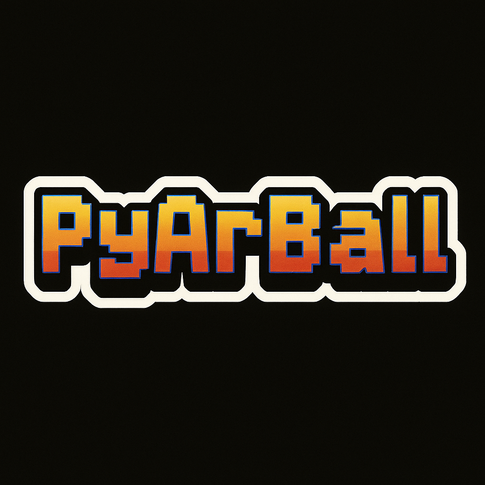
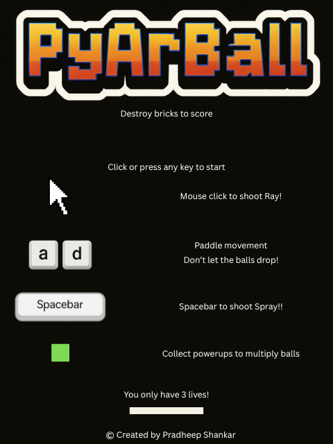

# PyArBall---A-Python-Arcade-game

**PyArBall** is a fast-paced, game physics-powered arcade game inspired by classics like *Arkanoid* , *Bricks Ball Crusher*  & *Tetris* — built using Python and Pygame.

> 🚫 **Note:** The source code is private to protect project integrity and originality. If you're interested in access, collaboration, or licensing, feel free to contact me directly.

---

## 🧠 Game Overview

- Multiple ball launches with powerups
- Curved difficulty progression
- Paddle collisions and live scoring
- Clean game loop with real-time interaction

---

## 📸 Screenshots

  

---

## 📄 Project Info

- Built with: Python 3.10, Pygame
- Runtime: Desktop (macOS, Windows, Linux)
- Controls: Keyboard + Mouse
- Audio/Visuals: Asset-ready for expansion

---

## 📬 Contact

For access requests, licensing, or showcasing the project:
- GitHub: [@PradheepShankarSays](https://github.com/PradheepShankarSays)
- Email: pradheep.shankar@gmail.com

For technical collaboration, licensing inquiries, or demo access, please [reach out](mailto:pradheep.shankar@gmail.com).

> Note: The full source code is private.
""")
